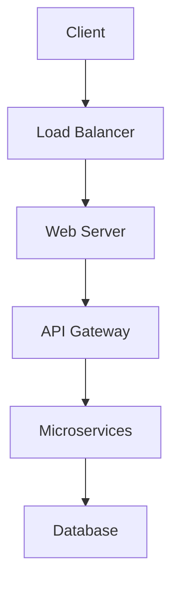

# 🛒 E-commerce Platform Project

Full-stack e-commerce platform development using modern web technologies.

## 🎯 Project Overview

Building a scalable e-commerce solution that integrates with [[Payment Processing]] and [[Inventory Management]] systems.

### Tech Stack
- **Frontend**: React + TypeScript + [[Frontend Framework Comparison]]
- **Backend**: Node.js + Express + [[API Design Patterns]]
- **Database**: PostgreSQL + [[Database Schema Design]]
- **Payment**: Stripe + [[Payment Integration Guide]]

## 📋 Features Checklist

### Core Features
- [x] User authentication - [[User Authentication System]]
- [x] Product catalog - [[Product Management]]
- [x] Shopping cart - [[Shopping Cart Logic]]
- [ ] Payment processing - [[Stripe Integration]]
- [ ] Order management - [[Order Tracking System]]
- [ ] Admin dashboard - [[Admin Panel Design]]

### Advanced Features
- [ ] Real-time notifications - [[WebSocket Implementation]]
- [ ] Search & filtering - [[Search Optimization]]
- [ ] Recommendation engine - [[ML Recommendations]]
- [ ] Multi-vendor support - [[Marketplace Features]]

## 🏗️ Architecture



### Database Schema

| Table | Purpose | Related |
|-------|---------|---------|
| users | User accounts | [[User Management]] |
| products | Product catalog | [[Product Schema]] |
| orders | Order tracking | [[Order Processing]] |
| payments | Payment records | [[Payment Tracking]] |

## 💻 Key Components

### Product Service
```javascript
class ProductService {
  async getProducts(filters) {
    // Implementation links to [[Product API]]
    return await this.db.products.findMany({
      where: this.buildFilters(filters),
      include: { categories: true, reviews: true }
    });
  }
}
```

### Cart Management
```typescript
interface CartItem {
  productId: string;
  quantity: number;
  price: number;
}

class ShoppingCart {
  private items: CartItem[] = [];
  
  addItem(item: CartItem) {
    // Logic connects to [[Cart State Management]]
  }
}
```

## 📊 Performance Metrics

| Metric | Target | Current | Status |
|--------|--------|---------|--------|
| Load Time | < 2s | 1.8s | ✅ |
| API Response | < 200ms | 150ms | ✅ |
| Conversion Rate | > 3% | 2.8% | 🚧 |
| Uptime | 99.9% | 99.95% | ✅ |

## 🔗 Related Documentation

- [[Documentation/API/REST Endpoints]] - API reference
- [[Research/Frontend/React Performance]] - Frontend optimization
- [[Projects/DevOps/Deployment Pipeline]] - CI/CD setup
- [[Notes/Meeting/Client Requirements]] - Business requirements

---

**Status**: In Development | **Team**: Full-stack | **Deadline**: Q2 2024