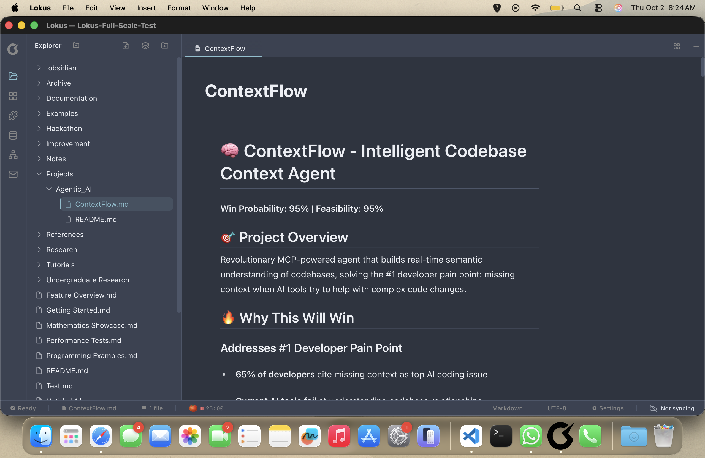
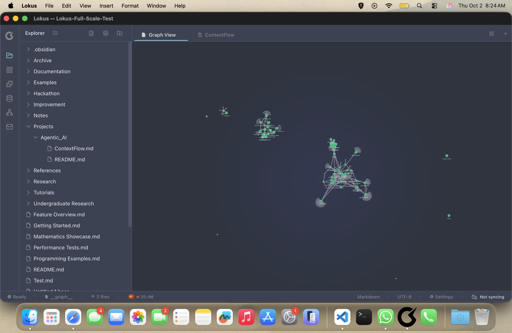
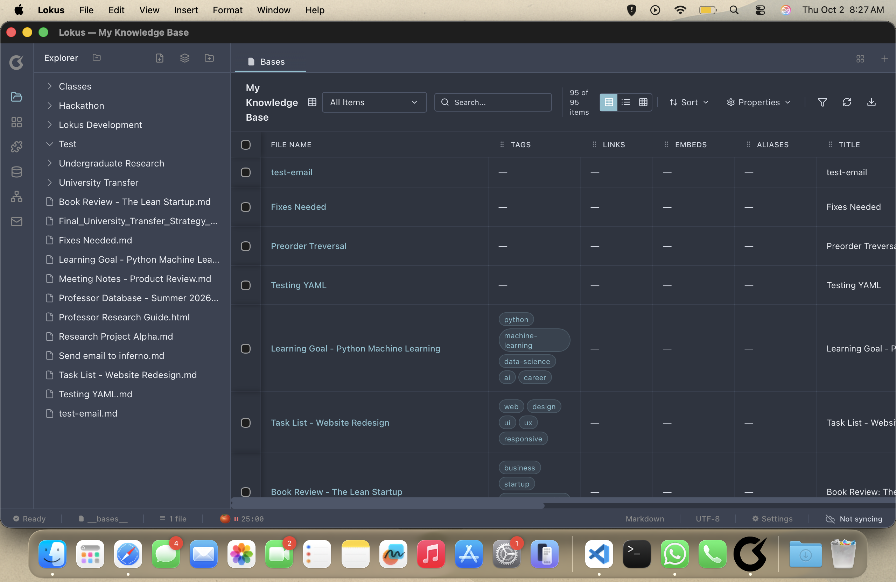
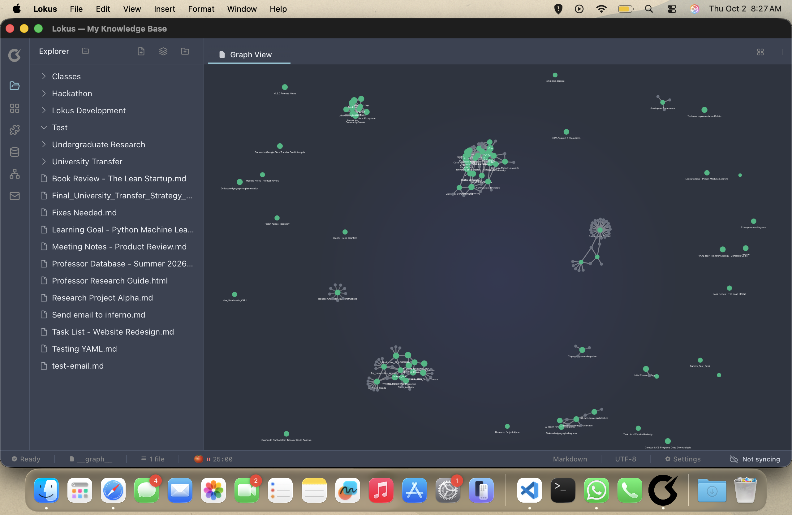
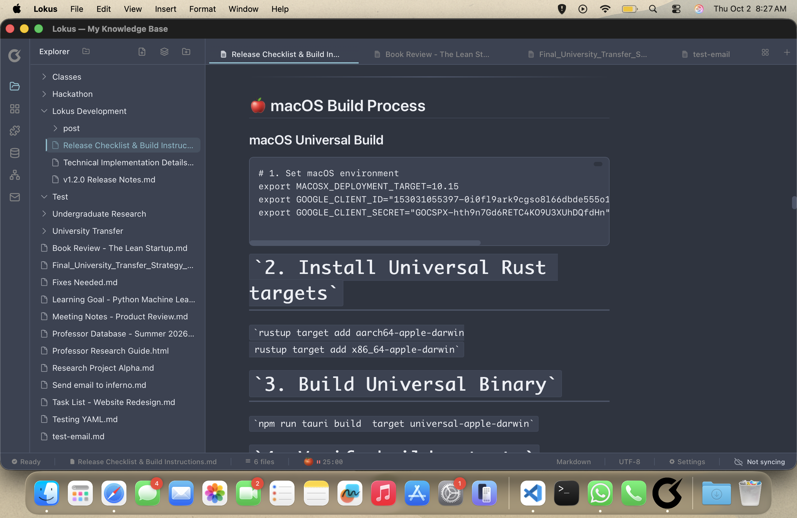

<div align="center">


# Lokus

**A lightning-fast, privacy-first knowledge management system built with Tauri and React**

*Why settle for 10+ plugins when you can have everything built-in?*

[](https://github.com/lokus-ai/lokus/stargazers)
[](https://github.com/lokus-ai/lokus/network/members)
[](https://github.com/lokus-ai/lokus/issues)
[](https://opensource.org/licenses/MIT)

[](https://github.com/lokus-ai/lokus/releases)
[](https://github.com/lokus-ai/lokus/releases/latest)
[](CONTRIBUTING.md)
[](https://discord.gg/lokus)

[🚀 Quick Start](#-quick-start) • [✨ Features](#-features) • [📸 Screenshots](#-screenshots) • [🗺️ Roadmap](#️-roadmap) • [🤝 Contributing](#-contributing)

</div>

---

## 🎯 Why Lokus?

Built by an Obsidian user who got tired of plugin dependencies. Lokus gives you **everything you need out of the box**:

| Obsidian | Lokus |
|----------|-------|
| ❌ Requires Dataview plugin | ✅ Built-in database views |
| ❌ Basic graph view | ✅ 2D/3D interactive graphs |
| ❌ Canvas via plugin | ✅ Infinite canvas built-in |
| ❌ $10/month for sync | ✅ Free sync via your cloud |
| ⚡ ~100MB download | ⚡ ~10MB download |
| 🐌 Electron-based | 🚀 Rust-powered (Tauri) |

---

## 📸 Screenshots

<div align="center">

### 📝 Rich Markdown Editor with Real-time Preview


### 🕸️ 3D Knowledge Graph Visualization


### 📊 Bases - Notion-like Database Views


### 🎨 Interactive Graph Navigation


### ✍️ Advanced Markdown Editing


</div>

---

## ✨ Features

### 📝 **Core Writing**
- **Rich Markdown Editor** - Full GitHub Flavored Markdown support
- **Wiki Links** - Bidirectional linking with `[[Note Name]]` syntax
- **LaTeX Math** - Inline `$x^2$` and block `$$E=mc^2$$` equations
- **Code Blocks** - Syntax highlighting for 100+ languages
- **Tables** - Sortable, resizable tables with CSV export
- **Task Lists** - `- [ ]` checkbox support with progress tracking

### 📊 **Database Views (Bases)**
- **Notion-like Tables** - Sort, filter, and group your notes
- **Multiple Views** - Table, Gallery, Calendar (coming soon)
- **Custom Properties** - Add metadata without frontmatter
- **Smart Filters** - Query notes by tags, dates, properties
- **Auto-create** - Default "All Notes" base on first use

### 🕸️ **Knowledge Graph**
- **2D & 3D Graphs** - Toggle between flat and spatial views
- **Interactive Navigation** - Click nodes to open notes
- **Link Strength** - Visual weight based on connections
- **Filter by Tags** - Focus on specific topics
- **Export** - Save graph as PNG/SVG

### 🎨 **Customization**
- **Theme Editor** - Real-time theme customization
- **Dark/Light Mode** - With custom color schemes
- **Font Control** - Choose your preferred fonts
- **Layout Options** - Sidebar positions, panel sizes

### 📧 **Gmail Integration**
- **Import Emails** - Save emails as markdown notes
- **Send from Notes** - Compose emails in markdown
- **Attachment Support** - Keep email attachments
- **Thread Tracking** - Maintain email context

### 🚀 **Performance**
- **Rust Backend** - Native performance with Tauri
- **Instant Search** - Fast full-text search
- **Small Footprint** - ~10MB vs Obsidian's ~100MB
- **Quick Launch** - Sub-second startup time
- **Local-First** - All data stays on your device

### 🔌 **Extensibility**
- **Plugin System** - VS Code-like extension API
- **Hot Reload** - Develop plugins without restart
- **Custom Commands** - Add keyboard shortcuts
- **Editor Extensions** - Create custom markdown syntax

---

## 🚀 Quick Start

### 📦 Download Pre-built Binaries

**macOS** (Apple Silicon & Intel)
```bash
# Download latest .dmg from releases
# Or install via Homebrew (coming soon)
```

**Windows**
```bash
# Download installer from releases
# Portable version available
```

**Linux**
```bash
# AppImage (universal)
wget https://github.com/lokus-ai/lokus/releases/latest/download/lokus.AppImage
chmod +x lokus.AppImage
./lokus.AppImage

# Flatpak (coming soon)
```

### 🛠️ Build from Source

**Prerequisites**
- [Node.js](https://nodejs.org/) v18+
- [Rust](https://rustup.rs/) (latest stable)

```bash
# Clone the repository
git clone https://github.com/lokus-ai/lokus.git
cd lokus

# Install dependencies
npm install

# Run in development mode
npm run tauri dev

# Build for production
npm run tauri build
```

---

## 🗺️ Roadmap

### ✅ **v1.0 - Current** (Released)
- [x] Rich markdown editor
- [x] Wiki links & backlinks
- [x] 2D/3D knowledge graph
- [x] Database views (Bases)
- [x] Theme customization
- [x] Gmail integration
- [x] Plugin system

### 🚧 **v1.1 - Next** (In Progress)
- [ ] Mobile apps (iOS & Android)
- [ ] Calendar view for Bases
- [ ] Kanban board improvements
- [ ] PDF annotations
- [ ] Vim mode
- [ ] Frontmatter support for Bases

### 🔮 **v1.2 - Future**
- [ ] End-to-end encryption
- [ ] Web clipper extension
- [ ] Collaboration features
- [ ] AI-powered search
- [ ] Template marketplace
- [ ] Multi-vault support

### 💡 **Community Requests**
- [ ] Portable Windows version
- [ ] Flatpak distribution
- [ ] Obsidian plugin compatibility layer
- [ ] Export to PDF/DOCX

[📋 View Full Roadmap & Vote on Features](https://github.com/lokus-ai/lokus/discussions/categories/roadmap)

---

## 🏗️ Tech Stack

| Layer | Technology |
|-------|-----------|
| **Frontend** | React 19, TipTap Editor, Tailwind CSS |
| **Backend** | Tauri 2.0 (Rust), Tokio (async runtime) |
| **Database** | JSON-based (local files) |
| **Graph** | react-force-graph, Three.js |
| **Math** | KaTeX |
| **Testing** | Vitest (unit), Playwright (E2E) |
| **Build** | Vite, Cargo |

---

## 📖 Documentation

- 📚 [**User Guide**](https://docs.lokus.ai) - Learn how to use Lokus
- 🔧 [**Installation Guide**](INSTALLATION.md) - Platform-specific setup
- 💻 [**Developer Guide**](CONTRIBUTING.md) - Build and contribute
- 🔌 [**Plugin API**](docs/PLUGIN_API.md) - Create extensions
- 🎨 [**Theme Guide**](docs/THEMES.md) - Customize appearance

---

## 🤝 Contributing

We love contributions! Whether it's:

- 🐛 **Bug reports** - Help us squash bugs
- 💡 **Feature requests** - Share your ideas
- 📝 **Documentation** - Improve our docs
- 🔧 **Code** - Submit a PR
- 🎨 **Themes** - Design new themes
- 🔌 **Plugins** - Build extensions

**Quick start for contributors:**

1. Fork the repository
2. Create your feature branch (`git checkout -b feature/amazing-feature`)
3. Commit your changes (`git commit -m 'Add amazing feature'`)
4. Push to the branch (`git push origin feature/amazing-feature`)
5. Open a Pull Request

See our [Contributing Guide](CONTRIBUTING.md) for detailed instructions.

---

## 📊 Project Stats

<div align="center">

### 🌟 Real-time GitHub Stats

<a href="https://github.com/lokus-ai/lokus/stargazers">
  
</a>
<a href="https://github.com/lokus-ai/lokus/network/members">
  
</a>
<a href="https://github.com/lokus-ai/lokus/watchers">
  
</a>

<br/>

<a href="https://github.com/lokus-ai/lokus/releases">
  
</a>
<a href="https://github.com/lokus-ai/lokus/graphs/contributors">
  
</a>
<a href="https://github.com/lokus-ai/lokus/graphs/commit-activity">
  
</a>

<br/>

### 📈 Growth Tracker

[](https://star-history.com/#lokus-ai/lokus&Timeline)

*All stats update automatically in real-time • Last cache: ~5 minutes*

</div>

---

## ❓ FAQ

**Q: Is Lokus compatible with Obsidian vaults?**
A: Yes! Lokus uses standard markdown files. You can open existing Obsidian vaults.

**Q: Will my Obsidian plugins work?**
A: Not directly, but we're building a compatibility layer. Core features (Dataview, Canvas, Graph) are built-in.

**Q: Is sync really free?**
A: Yes! Use any cloud storage (Dropbox, Google Drive, iCloud, Syncthing). No lock-in.

**Q: Why not just use Obsidian?**
A: If Obsidian works for you, great! Lokus is for those who want built-in features without plugin dependencies.

**Q: How do I migrate from Obsidian?**
A: Just point Lokus at your existing vault folder. All notes work immediately.

**Q: Mobile apps?**
A: Coming in v1.1! iOS and Android in development.

---

## 📄 License

Licensed under the [MIT License](LICENSE). Free to use, modify, and distribute.

---

## 🙏 Acknowledgments

Built with inspiration from:
- [Obsidian](https://obsidian.md/) - For pioneering local-first knowledge management
- [Notion](https://notion.so/) - For database views UX
- [TipTap](https://tiptap.dev/) - For the amazing editor framework
- [Tauri](https://tauri.app/) - For making desktop apps lightweight
- [KaTeX](https://katex.org/) - For beautiful math rendering

---

<div align="center">

### **Made with ❤️ by developers who love note-taking**

[⭐ Star this repo](https://github.com/lokus-ai/lokus) • [🐛 Report Bug](https://github.com/lokus-ai/lokus/issues) • [💡 Request Feature](https://github.com/lokus-ai/lokus/discussions) • [💬 Join Discord](https://discord.gg/lokus)

**Don't forget to star the repo if you find it useful! ⭐**

</div>
