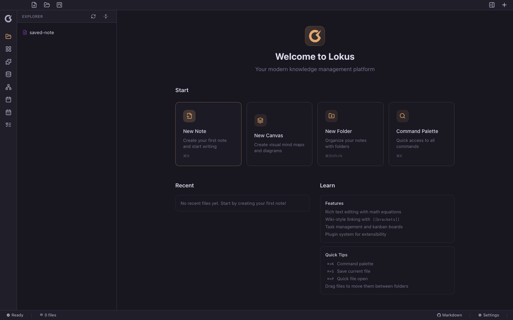
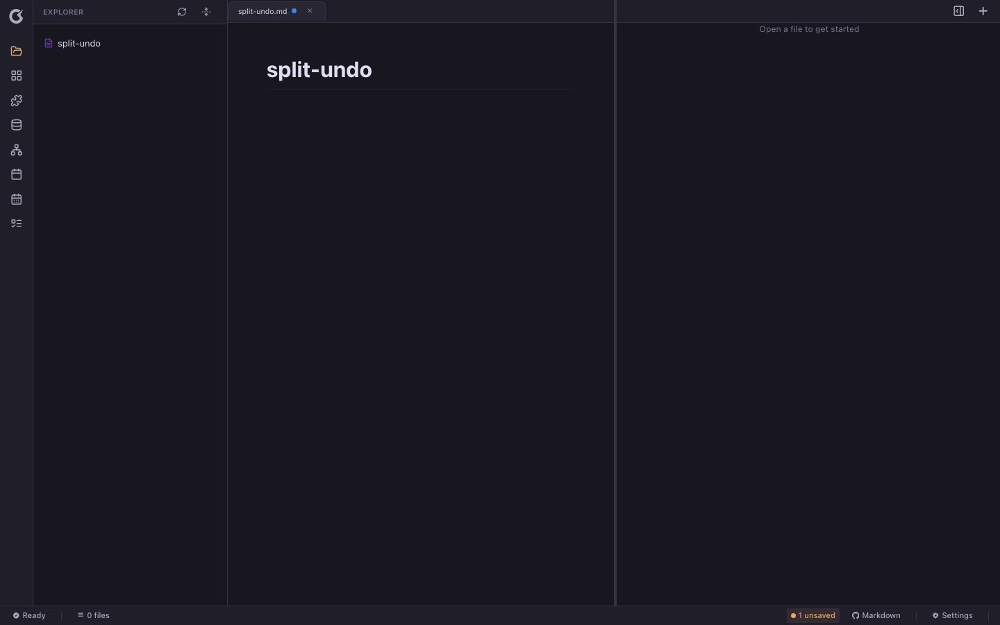
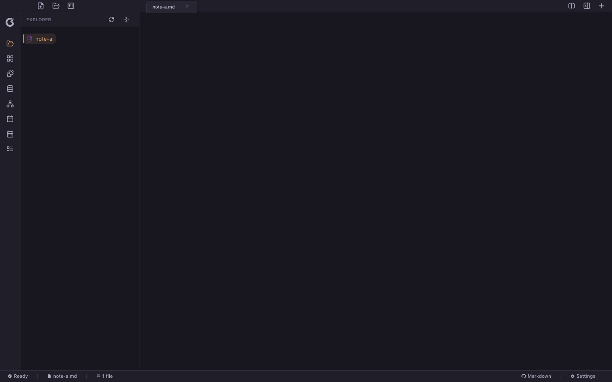
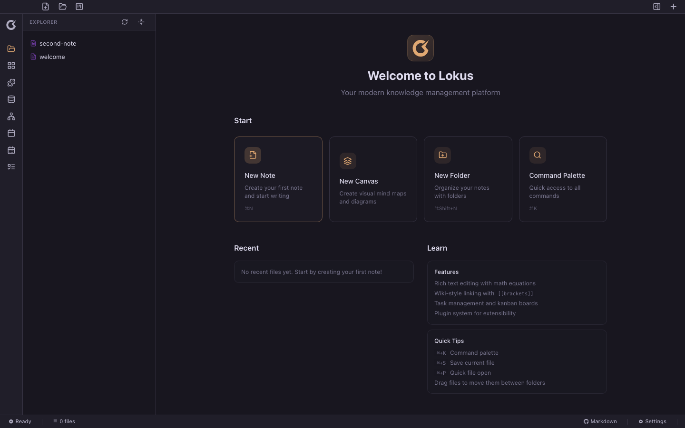
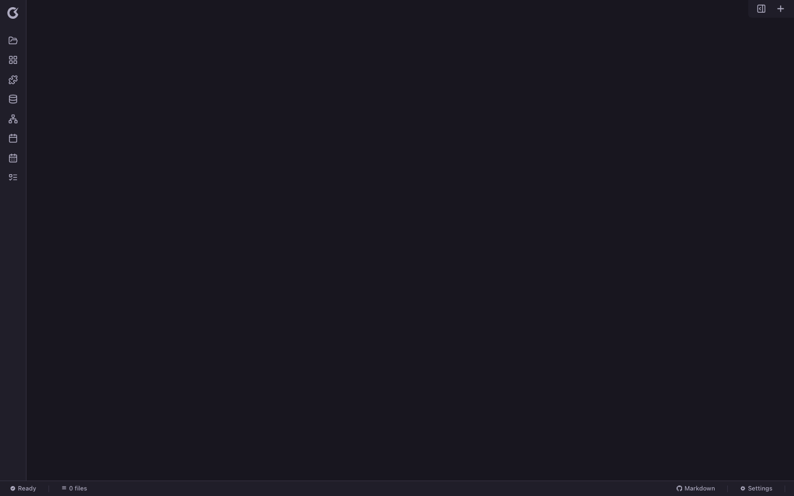

# Lokus AI-QA Report

- **Run**: 2026-07-08T00:33:56.596Z · runner: playwright-chromium + real vite frontend + disk-backed tauri mock (real temp vault folders) · AI decider: stub-persona (no ANTHROPIC_API_KEY)
- **Result**: 3 pass · 8 fail · 0 crash · 8 findings

## ❌ FAIL (8)

### ❌ Opening a note must not crash the editor (Node imports in client bundle)
> Expected overall: No module reachable from the editor imports Node builtins; opening a note renders the editor, not "View crashed".

#### 🐞 Editor bundle is webview-safe `major`

- **Expected:** Client-side editor code never pulls Node-only modules into the webview bundle
- **Actual:** EDITOR CRASHES ON NOTE OPEN ("View crashed — Click to recover"). Without the QA fs-shim, opening any note throws: Module "fs/promises" has been externalized for browser compatibility (at src/mcp-server/utils/graphIndex.js:8, reached from the editor AI action context). Offending import chains: ["src/editor/ai/actionContext.js → ../../mcp-server/utils/graphIndex.js (imports Node builtins)","src/core/ai/ContextAssembler.js → ../../mcp-server/utils/graphIndex.js (imports Node builtins)","src/core/ai/actions/vault-actions.js → ../../../mcp-server/tools/notes.js (imports Node builtins)"]
- **Repro steps:**

### ❌ Typed text must survive a crash/quit without manual save (autosave)
> Expected overall: After typing and a forced reload (simulated crash), the text is still there — in the editor or at least on disk.

- ✅ Typing works

#### 🐞 No data loss on crash/quit (autosave) `major`

- **Expected:** The draft text is preserved across a reload without manual Cmd+S (autosave or flush-on-close).
- **Actual:** DATA LOST. Editor after reload: "<empty>". Disk before crash: {"crash-draft.md":""}. Disk after: {"crash-draft.md":""}. The note file exists but the typed content was never written — there is no autosave and no flush on unload.
- **Screenshot:** 
- **Console errors:**
  - `console.error` Missing Supabase environment variables. Please set VITE_SUPABASE_URL and VITE_SUPABASE_ANON_KEY
  - `console.error` Access to fetch at 'https://config.lokusmd.com/config.json?t=1783470855064' from origin 'http://localhost:1420' has been blocked by CORS policy: No 'Access-Control-Allow-Origin' header is present on t
  - `console.error` Failed to load resource: net::ERR_FAILED
  - `console.error` Access to fetch at 'https://config.lokusmd.com/config.json?t=1783470855065' from origin 'http://localhost:1420' has been blocked by CORS policy: No 'Access-Control-Allow-Origin' header is present on t
  - `console.error` Failed to load resource: net::ERR_FAILED
- **Repro steps:**
  1. `createVault` real temp folder /var/folders/bm/pxctjpzn6rj01lpsc3wvnn8r0000gn/T/lokus-qa-run-xsTL1E/autosave-mrbchndc
  2. `newNote` via New File button, name "crash-draft"
  3. `type` "Meeting notes: shipped the Q3 roadmap, follow up with Dana about pricing."
  4. `forceReload` simulated crash/quit: hard page reload (no save flushed)

### ❌ Cmd+S persists the note to the vault folder and it survives reload
> Expected overall: After Cmd+S the .md file in the vault contains the text; after reload the note reopens with it.

- ✅ Cmd+S writes to disk

#### 🐞 Last open note restored after reload `major`

- **Expected:** Reopening the workspace shows the note you were working on
- **Actual:** SESSION NOT RESTORED: after reload the app shows "EXPLORER
saved-note
Welcome to Lokus

Your modern knowledge …" (Welcome screen) instead of the note. The note file IS on disk, but the persisted session is "{
  "open_tabs": [],
  "expanded_folders": [],
  "recent_files": [],
  "editor_layout": {
    "id": "group-1",
    "type": "group",
    "tabs": [],
    "activeT" — the session save effect runs only once, 500ms after workspace mount (before any tab is open), so open tabs are never persisted.
- **Screenshot:** 
- **Console errors:**
  - `console.error` Missing Supabase environment variables. Please set VITE_SUPABASE_URL and VITE_SUPABASE_ANON_KEY
  - `console.error` Access to fetch at 'https://config.lokusmd.com/config.json?t=1783470869901' from origin 'http://localhost:1420' has been blocked by CORS policy: No 'Access-Control-Allow-Origin' header is present on t
  - `console.error` Failed to load resource: net::ERR_FAILED
  - `console.error` Access to fetch at 'https://config.lokusmd.com/config.json?t=1783470869902' from origin 'http://localhost:1420' has been blocked by CORS policy: No 'Access-Control-Allow-Origin' header is present on t
  - `console.error` Failed to load resource: net::ERR_FAILED
- **Repro steps:**
  1. `createVault` real temp folder /var/folders/bm/pxctjpzn6rj01lpsc3wvnn8r0000gn/T/lokus-qa-run-xsTL1E/save-path-mrbci466
  2. `newNote` via New File button, name "saved-note"
  3. `type` "This note was saved with Cmd+S and must exist on disk."
  4. `save` ControlOrMeta+S
  5. `forceReload` simulated crash/quit: hard page reload (no save flushed)

### ❌ Content and undo history survive a pane split
> Expected overall: After Cmd+\ split, the note text is intact and Cmd+Z still undoes the last edit.

- ✅ Split shortcut is wired
- ✅ Undo history survives the split

#### 🐞 Content survives the split `major`

- **Expected:** The note text is still shown after splitting
- **Actual:** Editor text after split: "
---pane---
"
- **Screenshot:** 
- **Console errors:**
  - `console.error` Missing Supabase environment variables. Please set VITE_SUPABASE_URL and VITE_SUPABASE_ANON_KEY
  - `console.error` Access to fetch at 'https://config.lokusmd.com/config.json?t=1783470887973' from origin 'http://localhost:1420' has been blocked by CORS policy: No 'Access-Control-Allow-Origin' header is present on t
  - `console.error` Failed to load resource: net::ERR_FAILED
  - `console.error` Access to fetch at 'https://config.lokusmd.com/config.json?t=1783470887971' from origin 'http://localhost:1420' has been blocked by CORS policy: No 'Access-Control-Allow-Origin' header is present on t
  - `console.error` Failed to load resource: net::ERR_FAILED
- **Repro steps:**
  1. `createVault` real temp folder /var/folders/bm/pxctjpzn6rj01lpsc3wvnn8r0000gn/T/lokus-qa-run-xsTL1E/split-mrbcinmm
  2. `newNote` via New File button, name "split-undo"
  3. `type` "First sentence stays."
  4. `press` Enter
  5. `type` "UNDOME second sentence."
  6. `splitPane` emit lokus:toggle-split-view (Cmd+\ accelerator path)

### ❌ Graph hotkey (Cmd+Shift+G) shows the graph — never a blank center
> Expected overall: After the graph shortcut, the center pane renders a graph canvas (or stays on the editor); it must not go blank.

- ✅ Graph shortcut is wired

#### 🐞 Center still renders after graph hotkey `major`

- **Expected:** The center pane shows the graph view (canvas) or keeps the editor visible
- **Actual:** BLANK CENTER: graph rendered: false, editor rendered: false. The shortcut switches currentView to 'graph' but MainContent has no branch for 'graph', so nothing is rendered. DOM summary: editorPresent=false, bodyText="note-a.md
EXPLORER
note-a
Ready
note-a.md
1 file
Markdown
Settings"
- **Screenshot:** 
- **Console errors:**
  - `console.error` Missing Supabase environment variables. Please set VITE_SUPABASE_URL and VITE_SUPABASE_ANON_KEY
  - `console.error` Access to fetch at 'https://config.lokusmd.com/config.json?t=1783470894469' from origin 'http://localhost:1420' has been blocked by CORS policy: No 'Access-Control-Allow-Origin' header is present on t
  - `console.error` Failed to load resource: net::ERR_FAILED
  - `console.error` Access to fetch at 'https://config.lokusmd.com/config.json?t=1783470894467' from origin 'http://localhost:1420' has been blocked by CORS policy: No 'Access-Control-Allow-Origin' header is present on t
  - `console.error` Failed to load resource: net::ERR_FAILED
- **Repro steps:**
  1. `createVault` real temp folder /var/folders/bm/pxctjpzn6rj01lpsc3wvnn8r0000gn/T/lokus-qa-run-xsTL1E/graph-mrbcismz
  2. `newNote` via New File button, name "note-a"
  3. `type` "# Node A\nlinks make graphs"
  4. `save` ControlOrMeta+S
  5. `graphHotkey` emit lokus:graph-view (Cmd+Shift+G accelerator path)

### ❌ Closed window can be reopened from the dock
> Expected overall: Closing the window hides the app (by design); clicking the dock icon must bring it back.

- ✅ Close-window path is wired
- ✅ Close request reaches the window layer (hide-on-close)

#### 🐞 Dock click can restore the hidden window `major`

- **Expected:** If close hides the window (it does), the Rust side must handle macOS RunEvent::Reopen (dock click) and re-show it
- **Actual:** NO REOPEN HANDLER: the window is hidden on close but no RunEvent::Reopen / reopen handling exists anywhere in src-tauri — after closing the window, clicking the dock icon can never bring it back. Evidence: src-tauri/src/lib.rs:1305 — CloseRequested → hide()+prevent_close. Simulated window state after dock click: {"visible":false,"closeRequests":1}
- **Screenshot:** 
- **Console errors:**
  - `console.error` Missing Supabase environment variables. Please set VITE_SUPABASE_URL and VITE_SUPABASE_ANON_KEY
  - `console.error` Access to fetch at 'https://config.lokusmd.com/config.json?t=1783470900767' from origin 'http://localhost:1420' has been blocked by CORS policy: No 'Access-Control-Allow-Origin' header is present on t
  - `console.error` Failed to load resource: net::ERR_FAILED
  - `console.error` Access to fetch at 'https://config.lokusmd.com/config.json?t=1783470900765' from origin 'http://localhost:1420' has been blocked by CORS policy: No 'Access-Control-Allow-Origin' header is present on t
  - `console.error` Failed to load resource: net::ERR_FAILED
- **Repro steps:**
  1. `createVault` real temp folder /var/folders/bm/pxctjpzn6rj01lpsc3wvnn8r0000gn/T/lokus-qa-run-xsTL1E/lifecycle-mrbcixee
  2. `newNote` via New File button, name "lifecycle"
  3. `type` "window lifecycle test"
  4. `save` ControlOrMeta+S
  5. `closeWindow` emit lokus:close-window (menu path) -> window.close()
  6. `reopenFromDock` simulate macOS dock click after window close

### ❌ AI user: brand-new user sets up a vault and writes first notes
> Expected overall: A non-technical user can accomplish the basics without hitting anything broken, confusing, or lossy.

- ✅ AI user finished

#### 🐞 Unsaved note content lost after app restart `blocker`

- **Expected:** A notes app should not lose what I typed (autosave)
- **Actual:** After the app restarted, the editor shows: "<empty>" — my slash-menu heading is gone
- **Screenshot:** 
- **Console errors:**
  - `console.error` Missing Supabase environment variables. Please set VITE_SUPABASE_URL and VITE_SUPABASE_ANON_KEY
  - `console.error` Access to fetch at 'https://config.lokusmd.com/config.json?t=1783470916854' from origin 'http://localhost:1420' has been blocked by CORS policy: No 'Access-Control-Allow-Origin' header is present on t
  - `console.error` Failed to load resource: net::ERR_FAILED
  - `console.error` Access to fetch at 'https://config.lokusmd.com/config.json?t=1783470916854' from origin 'http://localhost:1420' has been blocked by CORS policy: No 'Access-Control-Allow-Origin' header is present on t
  - `console.error` Failed to load resource: net::ERR_FAILED
- **Repro steps:**
  1. `ai:goal` You're a brand-new non-technical user of Lokus (a markdown notes app). Set up your workspace and write your first two notes: one with a big heading, one that links to the other. Save one of them, then the app will restart at some point — check nothing you wrote was lost. Report anything confusing, broken, or surprising along the way. (decider: stub-persona)
  2. `createVault` real temp folder /var/folders/bm/pxctjpzn6rj01lpsc3wvnn8r0000gn/T/lokus-qa-run-xsTL1E/ai-user-mrbcj1x8
  3. `ai:new_note` {"name":"welcome"} — scripted step 1
  4. `newNote` via New File button, name "welcome"
  5. `ai:type` {"text":"# My first note\nTrying out Lokus today."} — scripted step 2
  6. `type` "# My first note"
  7. `press` Enter
  8. `type` "Trying out Lokus today."
  9. `ai:read_editor` {} — scripted step 3
  10. `ai:save` {} — scripted step 4
  11. `save` ControlOrMeta+S
  12. `ai:new_note` {"name":"second-note"} — scripted step 5
  13. `newNote` via New File button, name "second-note"
  14. `ai:type` {"text":"This links back to "} — scripted step 6
  15. `type` "This links back to "
  16. `ai:link` {"target":"welcome"} — scripted step 7
  17. `link` [[welcome]]
  18. `ai:open_slash_menu` {} — scripted step 8
  19. `openSlashMenu` type '/' in editor
  20. `ai:choose_slash_item` {"query":"head"} — scripted step 9
  21. `chooseSlashItem` head
  22. `ai:type` {"text":"Made with the slash menu"} — scripted step 10
  23. `type` "Made with the slash menu"
  24. `ai:force_reload` {} — scripted step 11
  25. `forceReload` simulated crash/quit: hard page reload (no save flushed)
  26. `ai:read_editor` {} — scripted step 12
  27. `ai:report_issue` {"title":"Unsaved note content lost after app restart","expected":"A notes app should not lose what I typed (autosave)","actual":"After the app restarted, the editor shows: \"<empty>\" — my slash-menu heading is gone","severity":"blocker"} — My unsaved note text is gone after the restart.

### ❌ Monkey/explorer: chaotic input must not crash or blank the app
> Expected overall: Huge pastes, rapid keys, weird unicode, and hotkey hammering never produce unhandled errors or a blank app.

- ✅ Monkey pass finished

#### 🐞 Editor disappeared during chaotic-but-legal input `major`

- **Expected:** The editing surface survives rapid hotkeys/clicks (or comes back on its own)
- **Actual:** No .ProseMirror on screen after a chaos burst — the user has no way to keep typing
- **Screenshot:** 
- **Console errors:**
  - `console.error` Missing Supabase environment variables. Please set VITE_SUPABASE_URL and VITE_SUPABASE_ANON_KEY
  - `console.error` Access to fetch at 'https://config.lokusmd.com/config.json?t=1783470919019' from origin 'http://localhost:1420' has been blocked by CORS policy: No 'Access-Control-Allow-Origin' header is present on t
  - `console.error` Failed to load resource: net::ERR_FAILED
  - `console.error` Access to fetch at 'https://config.lokusmd.com/config.json?t=1783470919021' from origin 'http://localhost:1420' has been blocked by CORS policy: No 'Access-Control-Allow-Origin' header is present on t
  - `console.error` Failed to load resource: net::ERR_FAILED
- **Repro steps:**
  1. `monkey:start` seed=42, 10 chaos bursts
  2. `createVault` real temp folder /var/folders/bm/pxctjpzn6rj01lpsc3wvnn8r0000gn/T/lokus-qa-run-xsTL1E/monkey-mrbcjbz0
  3. `newNote` via New File button, name "chaos"
  4. `monkey:hotkey-hammer` split/graph/save/sidebar shortcuts back to back

## ✅ PASS (3)

### ✅ Typing "# Hello" turns into an H1 heading
> Expected overall: `# ` at line start converts to a heading node as you type (markdown input rule).

- ✅ "# " creates an H1
- ✅ "## " creates an H2

### ✅ Slash menu opens and inserts a block
> Expected overall: Typing '/' pops the command menu; choosing 'Heading 1' inserts an H1 block.

- ✅ '/' opens the slash menu
- ✅ Slash item inserts the block

### ✅ '[[' links to another note
> Expected overall: Typing '[[Target' suggests the existing note and Enter inserts a wiki-link node.

- ✅ '[[' opens the link suggestion popup
- ✅ Wiki-link node is created
